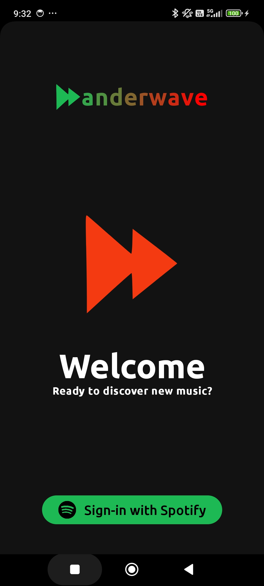
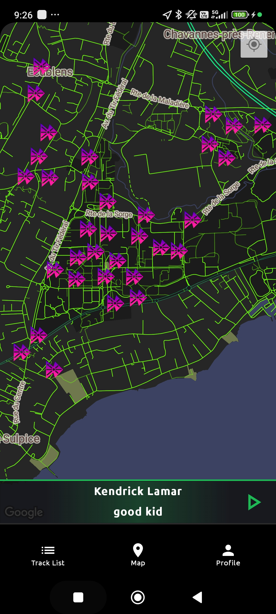
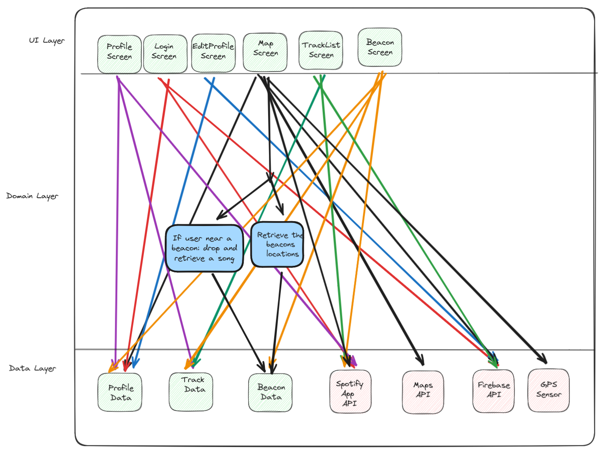

# Wanderwave
### CS-311 Group 12

In a day and age where music has never been as diverse, people tend to only listen to a fairly small subset 
of what is available. Wanderwave aims to expand users’ musical horizons by transforming their daily commutes
into adventures that will lead them to find new genres and artists. In that, it allows users to escape the
constraints imposed by the algorithms used by music providers, which by their very nature tend to restrain 
their recommendations to remain as close as possible to users’ habits.

The service works via the use of so-called *beacons* that are placed virtually around the world. For the 
user, a beacon is like an interactive map marker that contains a list of tracks. When near a beacon,
users can add songs to the beacon to share them with the world, or look at beacons to view what other
users have put there.

Wanderwave integrates with Spotify to provide insights about your music tastes, as well as be able to 
play music from your device. As such, users are required to link their Wanderwave account to their Spotify
account, as well as have the Spotify app installed on their phone.

## Usage

### Getting started
Upon first opening the app, you are presented with a login screen. Click on the *Connect to Spotify* 
button to link your Spotify account to Wanderwave, logging you in.

After loggin in, you will see a screen with a map interface. On it, you should find several icons that
represent Wanderwave Beacons. You can click on them to view their contents.

You can use the bottom app bar to navigate to your profile to view and edit it, as well as to the 
different playlists compiled for you by Wanderwave, like the list of songs you recently viewed.

After clicking a beacon and clicking the *Add a song* button, your Spotify home page is shown to you 
as a list, and you can select songs from there in order to add them to the beacon.

## Team
Wanderwave is brought to you by Team #12 of EPFL's 2024 iteration of the course
CS-311: *The software enterprise: from ideas to products*.
The team is made up of the members
Ayman, Clarence, Imade, Jonas, Menzo, Tsogt and Yoric.

## UI
[Figma Link](https://www.figma.com/files/project/215171825/Team-project?fuid=1213059135171411879)

## Architecture

Wanderwave is programmed for Android using the Jetpack Compose library. As such, it uses the MVVM
(Model-View-ViewModel) architecture to have the UI interact with the remote components.

The following remote components are used:
* Firebase Firestore: to store user and application data.
* Spotify App API: to retrieve user information and play music from within the app.
* Spotify Web API: to obtain various information about Spotify objects, such as album covers.
* Google Maps API: to display the map containing the beacons.
* Android location services: to retrieve the user's current location.
