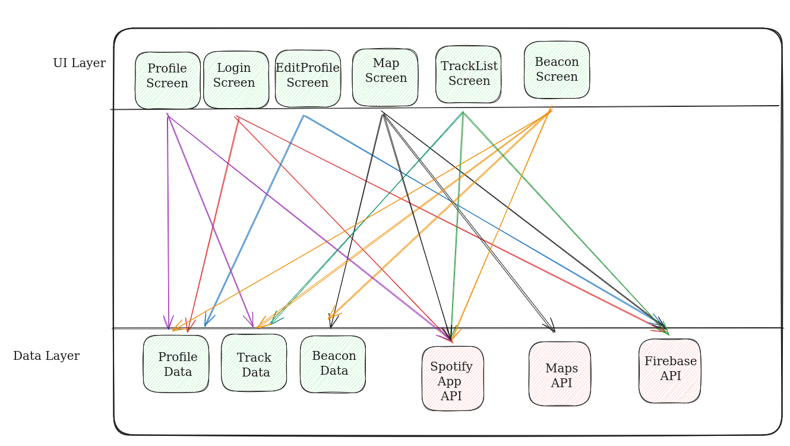

# CS-311-Group-12
# Wanderwave

## Group members
Tsogt Baigalmaa
Ayman Bakiri
Menzo Bouaissi
Imade Bouhamria
Clarence Joannis Linden
Jonas Michael Rindlisbacher
Yoric Pascal Züger

## Figma link
https://www.figma.com/files/project/215171825/Team-project?fuid=1213059135171411879

## Application

In a day and age where music has never been as diverse, people tend to only listen to a fairly small subset of what is available. Wanderwave aims to expand users’ musical horizons by transforming their daily commutes into adventures that will lead them to find new genres and artists. Our app will allow users to escape the algorithms used by music providers, which by their very nature tend to restrain their recommendations to remain as close as possible to users’ habits.
Users’ will be able to evaluate each song they received, and drops that have been highly appreciated by the community will reward the person who shared them with some points and achievements. Those points could then be used for things such as creating new beacons, increasing the likelihood of one’s dropped songs to be shared to other users, or maybe even to unlock in-app customisation items.

A handful of modes, described below, will also be available for users to switch between in order to adapt their experience to their current needs. In short, the app will be able to be used both passively and actively, as well as online and offline.

The problem:
Despite the large number of musical styles and their subgenres that are all well-saturated with a plethora of artists, it is often easy to get stuck in your own bubble. Services like Spotify and Apple Music tend to recommend songs and artists similar to what they know you like, and often times, you end up listening to the same songs over and over again. Wanderwave aims to bring a social aspect to music discovery by letting users share their favourite songs to others in their vicinity.

Core Concept: Beacon casting
Simply put, the service works via so-called “beacons” that are placed on a map interface. Beacons are basically containers that store and broadcast songs that users deposit into them. Some beacons are automatically placed in points of interest or widely populated areas, but users can also place their own beacons when there are none nearby. The app will use Spotify’s API to benefit from their large audience and robust music streaming service.

User story: “As a user, I want to know what others in my vicinity are listening to right now, so I can keep in touch to others around me”
Users can deposit songs into beacons, which can then be rated (up- or downvoted), as well as commented on, by others. This leads to a strong social aspect where users interact with each other, plus it gamifies the act of sharing music, when users get positive “karma” for highly-rated song placements or comments.

Core Concept: Wandering mode
Wanderwave implements a “real-time” wandering mode, where users act as mobile beacons. Instead of depositing songs into a container, users that want to share their music simply activate “provider” mode and listen to their songs on Spotify. The app broadcasts the currently playing song to their environment, where users in “receiver” mode can (automatically) pick them up and listen to them, or to the best automatically picked beacons in the area in the absence of broadcasters. This is more passive than beacon mode, as users don’t have to actively push songs into a beacon.

User story: “As a user, I want to have access to my music quickly without thinking about it because my time is precious”
An important feature of this mode is the very easy access for the user, where a single click brings him the music he wants, and maybe setup at the beginning.

Offline capacities
User story: “As a user with limited cellular data, want to use the service even while not connected to the internet constantly”
Wanderwave fetches beacon data for the (configurably-sized) environment while online (like being connected to Wi-Fi at home or at your hotel), so that being offline is less of an issue for beacon mode. Users can also add songs to beacons, a transaction which will be executed as soon as they are connected again. 

Core Concept: Culture mode
User story: “As a user that is passionate about my culture, I want tourists visiting my area to know about local music trends and historically relevant music”
Wanderwave shows for tourist or people that want to discover local culture, songs that people listen close by and that are in relation with the surrounding culture. It can be some historical facts, for example, Mozart songs in Vienna, or Hits from past festivals when near Woodstock. Everything that is historically related to somewhere can be broadcasted.

User story: “As an individual who likes to take walks in remote locations, I want good music that fits the atmosphere recommended to me, so I can fully immerse myself in my surroundings”
But, Wanderwave can also recommend music to you based on your environment. Simply describe what your surroundings look like or give him some context, maybe in the form of a photo or a text for example, and Wanderwave will curate a playlist that fits that atmosphere for you. If you are happy with the selection, you can easily create a beacon with the songs for the next people to find. 

The main modes are explained previously, now here is a recap and the features we want to add that go in conjunction with the modes.
Core Features
Discover new songs and musical genres by walking around
Default mode: Get and send music from and to the nearest beacon.
Select one or multiple playlists from Spotify to share from, and receive everything in a Wanderwave playlist
Have the option to manually pull songs from a beacon or to automatically receive them
Add the ability to select the range in which beacons will be selected
Wandering “real-time” mode: directly exchange songs with other users nearby rather than through beacons
Exchange directly with other users that are casting their listening
Very quick one tap listening
Culture mode: Same as default, but beacons are now set to historical/culturally significant landmarks and contain songs related to the context rather than other users’ suggestions.
Mozart in Vienna
Hits from past festivals when near Woodstock
Local artists’ hits
Offline mode: Record the user’s path and retrieve/send songs from/to beacons close to the itinerary they followed

Choose recommendations type
Fully random
Based on current habits
Anything but current habits

Evaluate songs received
Allows a form of user ranking
Enables better recommendations if user wants them

Additional Features
Social interactions
“Speed-dating”: exchange 5 songs with random users and decide if you want to add them as friends.
Find people with similar taste as you
Get a recommendation pool generated from your friends’ own listening habits
Songs review : the more popular the songs you share become, the more points you earn
Add comments to beacons/songs you have received
Keep it entirely optional, profile is hidden by default
Profile
Stats (#drops, #likes, #received…)
Links to other social networks accounts
Friends list
Vanity items (bought with points)
Options
Choose whether you send and receive, only send or only receive
Core Users
As a Vortex resident, I want to discover what music others in my community are listening to, so that I can uncover new songs and diversify my musical experiences during my daily commute to EPFL

As a fan of a lesser-known artist, I would like to boost their popularity by allowing other people to discover them

As a tourism office, I want to create a more immersive experience for visitors by providing a selection of songs for some local landmarks

As a history passionate tourist, I want to discover historical songs by showing some context (text, image, or time period)

## Architecture Diagram

The following is the architecture diagram of our application

